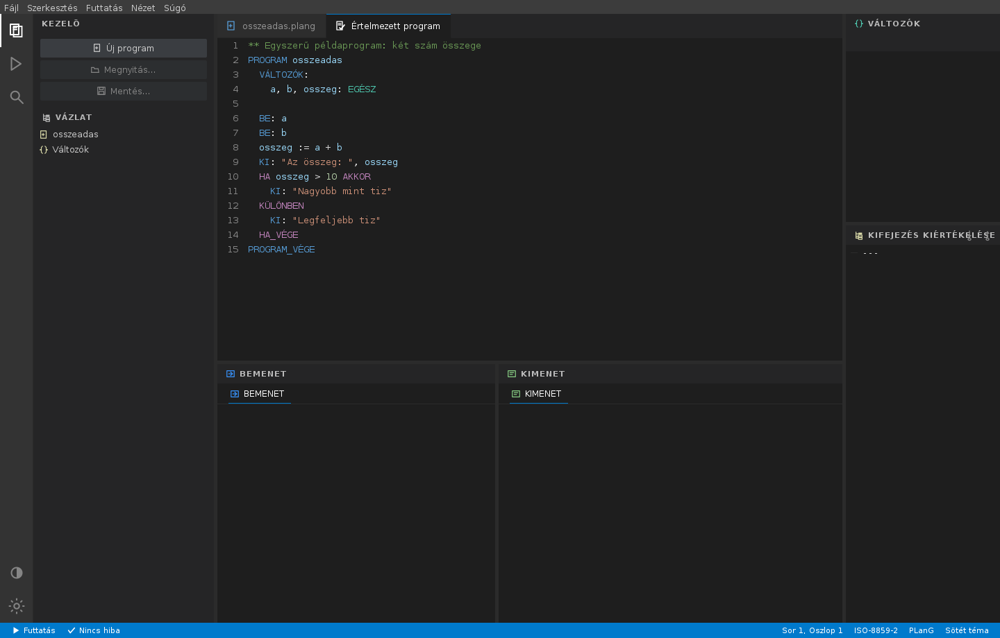

# PLanG fejlesztőkörnyezet

A PPKE ITK **PLanG** oktatási programozási nyelvének fejlesztőkörnyezete,
teljesen újratervezett, **Visual Studio Code** stílusú felülettel.



## Asztali indítás

```sh
java -jar plang.jar
```

## Android (tablet) változat

A tároló tartalmazza a fejlesztőkörnyezet **Android tablet** változatát is
az [`android/`](android/README.md) könyvtárban: ugyanaz a VS Code stílusú
felület és funkciókészlet (értelmezés, futtatás, léptetés, töréspontok,
állapottábla, kifejezésfa, csatornák, témák, kódkiegészítés, keresés/csere,
ISO-8859-2 fájlok), a **`prog` értelmezőt változatlanul, forrásmegosztással**
használva – így a nyelvi viselkedés bitre azonos az asztaliéval.

```sh
cd android && ./gradlew :app:assembleDebug   # APK: app/build/outputs/apk/debug/
```

Részletek: [android/README.md](android/README.md). A repó CI-je
(`Android APK` workflow) minden pushra lefordítja és műtermékként feltölti
az APK-t.

## Fordítás forrásból

```sh
./build.sh          # fordítás + plang.jar
./build.sh run      # fordítás + azonnali indítás
```

Ha nincs `javac` a gépen, de van Eclipse-fordító:

```sh
ECJ_JAR=/eleresi/ut/ecj.jar ./build.sh
```

## A felület

| Terület | Tartalom |
| --- | --- |
| **Tevékenységsáv** (bal szél) | Kezelő, Futtatás és hibakeresés, Keresés; alul témaváltó és beállítások |
| **Oldalsáv** | a választott nézet gombjai és a program **vázlata** (program, eljárások, függvények) |
| **Szerkesztő** | szintaxiskiemelés, sorszámozás, behúzás-segédvonalak, hibaaláhúzás, keresősáv |
| **Fülek** | `névtelen.plang` (szerkesztő) és `Értelmezett program` (a feldolgozott sorok) |
| **Alsó panel** | `BEMENET` és `KIMENET` csatornák külön fülekkel |
| **Vizsgálópanel** (jobb oldal) | Változók (állapottábla), Kifejezés kiértékelése, Hívási verem |
| **Állapotsor** | futtatás, hibaszám, lépésszám, kurzorpozíció, kódolás, téma |

Sötét (Dark+) és világos (Light+) színséma is választható – a tevékenységsáv alsó
ikonjával vagy a `Nézet ▸ Téma váltása` menüponttal.

## Billentyűparancsok

| Parancs | Művelet |
| --- | --- |
| `Ctrl+N` | Új program |
| `Ctrl+O` | Megnyitás |
| `Ctrl+S` | Mentés (ha van fájlnév, néma mentés) |
| `Ctrl+Shift+S` | Mentés másként… |
| `Ctrl+Z` | Visszavonás |
| `Ctrl+Y` / `Ctrl+Shift+Z` | Újra |
| `Ctrl+B` | Értelmezés |
| `F5` | Futtatás |
| `Shift+F5` | Futtatás vége |
| `F9` | Töréspont ki/be az aktuális soron (vagy kattintás a sorszámsávra) |
| `F10` | Lépés (step) – egy végrehajtási állapotot halad |
| `F6` | Folytatás a következő töréspontig (vagy a program végéig) |
| `Ctrl+F` | Keresés |
| `Ctrl+H` | Csere |
| `Ctrl+G` | Ugrás sorra |
| `Ctrl+/` | Megjegyzés ki/be |
| `Ctrl+D` | Sor megkettőzése |
| `Alt+↑` / `Alt+↓` | Sor mozgatása |
| `Tab` / `Shift+Tab` | Behúzás növelése / csökkentése |
| `Ctrl+ +` / `Ctrl+ -` | Betűméret növelése / csökkentése |
| `Ctrl`+egérgörgő | Betűméret állítás |
| `Ctrl+Space` | Kódkiegészítés (kontextusfüggő javaslat) |
| `Ctrl+,` | Beállítások |

További funkciók:

- **Jobbklikk-menü** a szerkesztőben: Visszavonás / Kivágás / Másolás / Beillesztés / Mind kijelölése.
- **Legutóbbi fájlok** almenü a Fájl menüben (max. 8 elem, Preferences-ben tárolva, „Lista törlése” ponttal).
- **Automatikus `.plang` kiterjesztés**: ha mentéskor nincs kiterjesztés, hozzáadódik.
- **Beállítások megmaradnak**: betűtípus, méret, lépésszám, téma, behúzás-segédvonalak, ablakméret/pozíció, osztópanelek helyzete, legutóbbi fájlok – `java.util.prefs.Preferences`-ben.
- **Parancssori megnyitás**: `java -jar plang.jar program.plang` betölti a fájlt induláskor.
- **Kódkiegészítés / IntelliSense** (`Ctrl+Space`, gépelés közben automatikusan is):
  kontextusfüggő javaslatok – deklarációban (`x: ` után) **típusnevek**, kifejezésben a
  program saját azonosítói (változó, eljárás, függvény) és a beépített függvények,
  ékezet-független prefix-illesztéssel. Egyetlen találatnál azonnal kiegészít, többnél
  lista jelenik meg; a **↑ / ↓** (és PageUp / PageDown) a javaslatok között lépked,
  a **Tab** vagy **Enter** elfogadja, az **Esc** bezárja. Az automatikus felbukkanás
  a szerkesztőben hagyja a fókuszt, így a gépelés nem akad meg.
- **Hibajelölés és hibánkénti ugrás**: az értelmezés a szerkesztőben is megjelöli a hibás
  sorokat (piros pötty a sorszámsávban, vörös sorkiemelés); az állapotsor hiba-cellájára
  kattintva a következő hibára ugrik és kiírja az üzenetét.
- **Debugger**: **töréspontok** (`F9`, vagy kattintás a sorszámsávra – piros pötty jelzi),
  **lépésenkénti végrehajtás** (`F10`) és **folytatás a következő töréspontig** (`F6`).
  Léptetés közben a szerkesztő kiemeli az aktuális lépés sorát, az állapottábla és a
  kifejezésfa pedig mutatja a változók és a kifejezések értékét abban a lépésben.
  (A motor előre kiszámolja az állapotokat, így a léptetés visszafelé is szabadon
  lehetséges az állapottáblára kattintva.)
- **Pontos futás-visszajelzés**: futás után az állapotsor nem állítja azt, hogy a program
  futna – „Kész – N lépés” jelenik meg, amíg a **Futtatás vége** ki nem üríti az eredményt.
- **Futás után vissza a szerkesztőbe** (kapcsolható): a *Beállítások* között bekapcsolható,
  hogy a futtatás befejeztével a felület magától visszaálljon szerkesztő módba.

## Munkafolyamat

1. **Értelmez** (`Ctrl+B`) – a szöveget programsorokká alakítja, hibákat jelöl,
   és létrehozza a be-/kimeneti csatornák füleit.
2. A **BEMENET** fülre beírod a program bemenetét.
3. **Futtatás** (`F5`) – a program lefut, az állapottábla soronként mutatja a
   változók alakulását, a **KIMENET** fülön megjelenik az eredmény.
4. Az állapottábla egy sorára kattintva a szerkesztő kiemeli a hozzá tartozó
   programsort, a **Kifejezés kiértékelése** fa pedig lebontja az adott lépést.
5. **Futtatás vége** (`Shift+F5`) visszaáll szerkesztő módba.

## Alprogramok

Az eljárások és függvények kezelése – az eredeti alkalmazással egyezően – csak
kapcsolóval érhető el; ilyenkor jelenik meg a **Hívási verem** panel, valamint a
be-/kilépés gombjai:

```sh
java -Dhu.ppke.itk.plang.subprograms=on -jar plang.jar
```

## További kapcsolók

| Kapcsoló | Hatás |
| --- | --- |
| `-Dhu.ppke.itk.plang.subprograms=on` | alprogramok (eljárás, függvény) engedélyezése |
| `-Dhu.ppke.itk.plang.errorDlg=off` | belső hiba esetén párbeszédablak helyett kivétel |

## A projekt szerkezete

```
src/main/java/hu/ppke/itk/plang/
├── plang.java              belépési pont (téma + Look&Feel beállítása)
├── prog/                   a nyelv értelmezője és futtatója (változatlan)
└── gui/
    ├── MainFrame.java      a főablak (a munkafelületet fogja keretbe)
    ├── Workbench.java      a teljes VS Code stílusú munkafelület
    ├── StreamTabs.java     be-/kimeneti csatornák fülekkel
    ├── PrefDialog.java     beállítások
    ├── theme/Theme.java    színpaletták (Dark+ / Light+) és betűtípusok
    ├── editor/             kódszerkesztő, szintaxiskiemelés, sorszámozás
    └── widgets/            tevékenységsáv, fülsor, állapotsor, gombok, keresősáv
```

Az alkalmazásnak nincs külső függősége, és képfájlokat sem használ: minden
ikon vektorosan, kódból rajzolódik (`widgets/VSIcons.java`), így tetszőleges
felbontáson éles marad, és a téma színeit veszi fel.

A `prog` csomag – a nyelv értelmezője – **érintetlen maradt**: a felújítás
kizárólag a felhasználói felületet érinti, a nyelvi viselkedés bitre azonos.

## Tesztelés

A felület fej nélkül is tesztelhető: `new Workbench((JFrame) null)` – a teljes
funkcionalitás ellenőrizhető grafikus környezet nélkül.

Funkcionális teszt futtatása (60+ ellenőrzés):

```sh
# JRE beszerzése PyPI-ról (ha nincs javac)
python3 -m venv /tmp/jvenv
/tmp/jvenv/bin/pip install -q jdk4py
JH=$(echo /tmp/jvenv/lib/python3.*/site-packages/jdk4py/java-runtime)

# ECJ fordító (3.46, Java 25 kompatibilis)
mkdir -p ~/.plang-tools
gh api repos/NorbertXYZ/eclipse-maven/git/blobs/ada8fbcad988cebd85f72ddee3a2e66b4a30be6d \
   -H "Accept: application/vnd.github.raw" > ~/.plang-tools/ecj.jar

# fordítás + teszt
rm -rf /tmp/out && mkdir -p /tmp/out
$JH/bin/java -jar ~/.plang-tools/ecj.jar -nowarn -8 -encoding UTF-8 \
   -d /tmp/out $(find src/main/java -name '*.java') tools/FuncTest.java
$JH/bin/java -Djava.awt.headless=true -Dfile.encoding=UTF-8 -cp /tmp/out FuncTest

# jar-ból is
$JH/bin/java -Djava.awt.headless=true -Dfile.encoding=UTF-8 -cp /tmp/out:plang.jar FuncTest
```

A teszt lefedi a betöltés/mentés ISO-8859-2 kódolását, az értelmezést, futtatást,
állapottábla-interakciókat, másolást, témaváltást, alprogram-módot, valamint az
új funkciókat: Undo/Redo csoportosítást, néma mentést, `.plang` kiterjesztést,
Preferences perzisztenciát, parancssori betöltést és legutóbbi fájlokat.

Képernyőképek generálása fej nélkül:

```sh
$JH/bin/java -jar ~/.plang-tools/ecj.jar -nowarn -8 -encoding UTF-8 \
   -d /tmp/out $(find src/main/java -name '*.java') tools/Screenshot.java
$JH/bin/java -Djava.awt.headless=true -Dfile.encoding=UTF-8 -cp /tmp/out Screenshot
```
